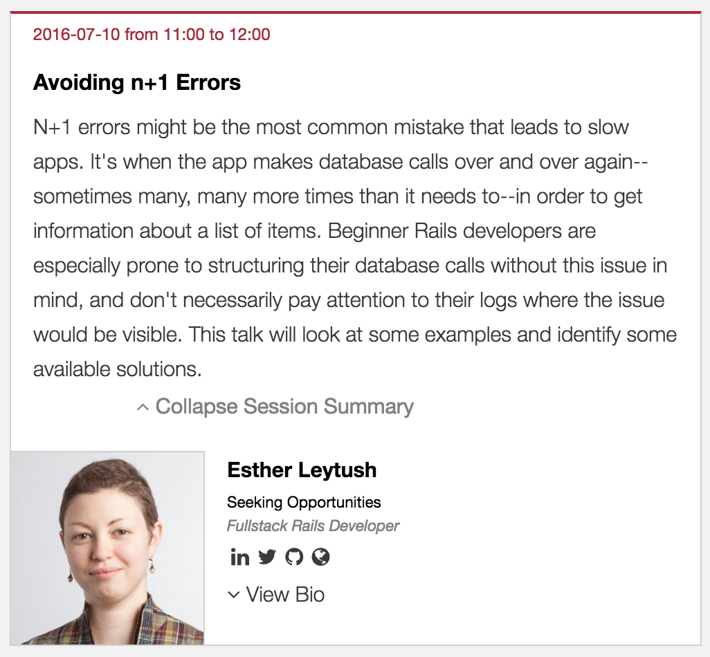
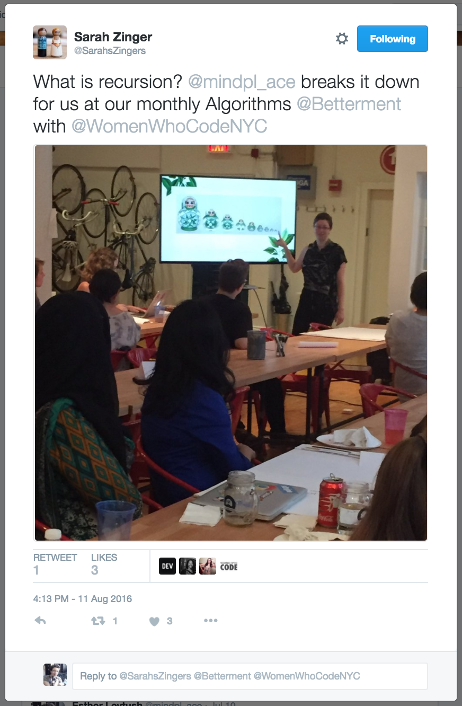
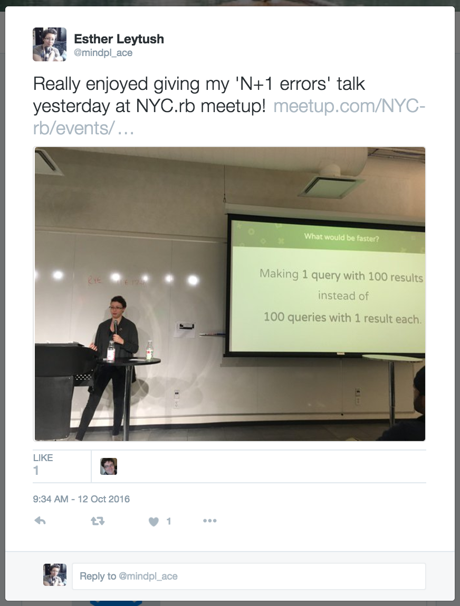

# The underestimated importance of giving talks as a beginner or junior engineer

I can't say enough about the positive qualities of giving talks as you are job-hunting, especially as a junior developer fresh out of coding bootcamp, a self-taught program, or college. Here's my list of the most important reasons.

## 1. It makes you accountable to learning something really well.

When I applied to give this talk at Rails Camp at the United Nations during the summer of 2016, I knew nothing about [N+1 errors in Rails](https://estherleytush.com/2016/07/10/avoiding-n-plus-one-queries.html). In fact, my very first interview had asked me what N+1 errors were, and I had no idea. When I started digging, I realized that if I didn't know what they were, and could easily assume my fellow bootcampers didn't know what they were, I could probably help someone out by doing an introduction on this topic.

I knew experienced developers would most likely know about this topic. But you can't wait until you're an expert to give talks. You can't expect, and you don't need to expect, that your audience is going to be more experienced than you. Quite the contrary: going to meetups, I expected everyone to know more than me, but discovered that while some people were way ahead of me in knowledge and skill, others knew much less than me. Just contextualize your talk for newbies or whoever, and be clear about where you personally are as a developer.

As a developer, too, I can also tell you that I love seeing more junior developers expose their knowledge in giving talks.

## 2. It gets you a soapbox from which to show, rather than tell, your skills.

> "My job search after graduation is interesting because I tried the traditional way of going through LinkedIn and Indeed.com, and sending my off resume. And maybe I'm a sensitive person, but I got so many rejections, it was depressing.  
After two weeks of that, I scrapped that entire process and reached out to the Meteor NY meetup organizer I knew and asked if I could present a 5 to 10-minute lightning talk, and they said, "Sure, go ahead."  
The way I pitched the lightning topic was that I already had something to present. I didn't. I had nothing. Just an idea. So I stopped everything else I was doing, and for the next seven days, all day, I worked on this presentation. In the presentation, I built something similar to Chess.com – an online chess app that users can play in real time. And I showed how to do that with React and Meteor."
  ~ Tom Goldenberg, ["Advice From a Coding Bootcamp Grad"](https://www.coursereport.com/blog/podcast-advice-from-coding-bootcamp-grad-tom-goldenberg)

Like Tom above, I sent out hundreds of resumes in response to job ads and basically got no positive responses back whatsoever. People just wouldn't give me a chance. And who could blame them? I had nearly nothing on my resume except 'Dev Bootcamp' and a couple of very green projects.

**By contrast, when I applied to give talks, I had something like an 80% acceptance rate.** This was an incredible opportunity for me to actually get in front of people who could either hire or recommend me. That's exactly what happened: I got out in front of people and showcased my knowledge by giving technical talks, and got leads and interviews because of that.

## 3. You get much better exposure in your community.

> "[It] was that lightning talk that got me almost every lead that I've had since then. So many people there gave me business cards and people who weren't there saw I was involved and said, "Hey, we need a developer for Meteor or for React. Let's talk." "  
~ Tom Goldenberg, ["Advice From a Coding Bootcamp Grad"](https://www.coursereport.com/blog/podcast-advice-from-coding-bootcamp-grad-tom-goldenberg)

I was able to go to [Windy City Rails](https://windycityrails.com/), a major Rails conference in Chicago, entirely for free (paid only for the flight) because I signed up to give a talk, "Enter By Bootcamp":

<iframe width="560" height="315" src="https://www.youtube.com/embed/Z4j57V2SAsA" frameborder="0" allowfullscreen></iframe>

Thanks to that weekend, I not only landed an interview with a company and a slew of professional connections in Chicago, but also met a developer who ran a project called [SheNomads](https://twitter.com/shenomads?lang=en), and ended up recording a podcast with her. Plus, I was able to post about my WindyCityRails talk on LinkedIn and Twitter and got even more traction out of that that way.

## 4. Seriously, it lands you interviews.

> "Another way I’ve landed interviews is by presenting at a meetup. This is a much better way to meet people in the room, rather than just being another guy / girl in the audience. Be courageous and put yourself in front of others. Showcase your talent."
  ~ Tom Goldenberg, ["Open Letter to Employers on Behalf of Bootcamp Grads"](https://medium.com/@tomgoldenberg/open-letter-to-employers-on-behalf-of-bootcamp-grads-and-also-to-bootcamp-grads-b40a722ced85#.giztbxbz6)

After this recursion talk, a developer from Betterment took me aside and asked if I would be interested in working there: that translated very quickly into interviews.

After this (second) [N+1 Errors talk at NYC.rb meetup](https://www.meetup.com/NYC-rb/events/231306324/), I spoke with the CTO of [Groundwork](https://www.buildgroundwork.com/#main) who was in the audience. That turned into an interview as well, and they ended up making me an offer (I wrote about that [here](https://estherleytush.com/2016/10/20/five-offers-in-four-months.html)).  

## Okay, I'm convinced! How do I get my talks accepted?

Now we're talking! Here's some tips from pros:

* Schneems' [article on getting your talk proposal accepted](https://www.schneems.com/blogs/2016-04-07-conference-proposal)
* Lena Reinhardt's [talk proposal preparation from start to finish](https://wunder.schoenaberselten.com/2016/02/16/how-to-prepare-and-write-a-tech-conference-talk/)
* CloudFoundry's ["3 Keys to Getting Your Talk Accepted At A Conference "](https://www.cloudfoundry.org/3-keys-to-getting-your-talk-accepted-at-a-conference/)

Now, you might have noticed that these are skewed towards conferences, but meetup talks are a very good way to start (and those are most of what I've done, too). The setup for that is basically the same as for a conference talk, except much easier and lighter. You want to choose and pitch a topic that you can comfortably relate to someone in a window of 10-25 minutes, ideally with code samples.

Next week, I'm running an [event at Dev Bootcamp where alumni give lightning talks](https://www.meetup.com/DBC-NYC/events/234697108/). Here are some proposals that have been accepted:

> **"Lessons from Code Review"**: "In this talk, I will share some of the lessons I have learned from reviewing others' code, from revising scripts to entering a new codebase during my first open source contribution.  Most of the code will be in Python and an emphasis will be placed on approaching your own learning thoughtfully."

> **"Refactoring for Readability in Ruby"**: "I will talk about how to refactor Ruby code with readability in mind. Readable code is easy to understand and change. Writing readable code is a not only a means to building more performant apps, it's also a kindness to yourself and your fellow developers. No one wants to spend hours trying to parse dense, inscrutable code."

> **"Getting Started with Jekyll"**: "Jekyll is a wonderful choice for building static sites, lightweight CMS add-ons, and more. It's a Ruby-based project made by the creators of Github, and it's a joy to use. This talk will be a quick introduction to getting started with your first Jekyll project to get a sense of scope, value, and use."

## Go forth and propose talks.

Find your nearest technical meetups. If they aren't explicitly calling for talks, reach out directly to organizers and let them know you're interested in doing talks and asking for opportunities to do so.

Apply to speak at conferences for your chosen languages and technologies.

It's a supercharger for your job hunt: don't miss out on making this opportunity for yourself.

### Resources

* ["Get Your Conference Proposal Accepted"](https://schneems.com/blogs/2016-04-07-conference-proposal)
